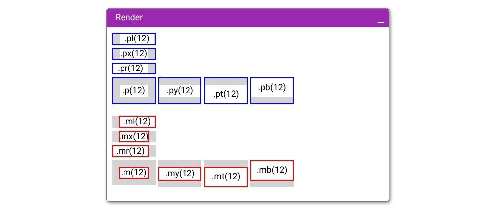
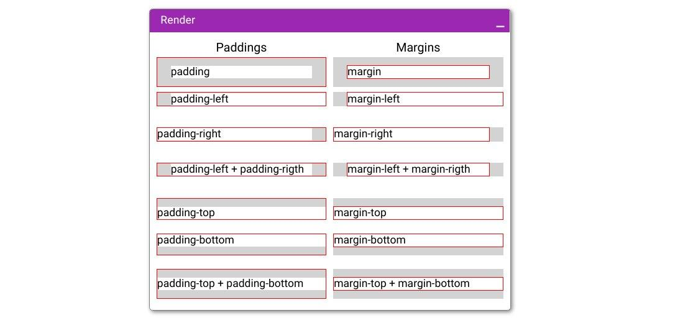
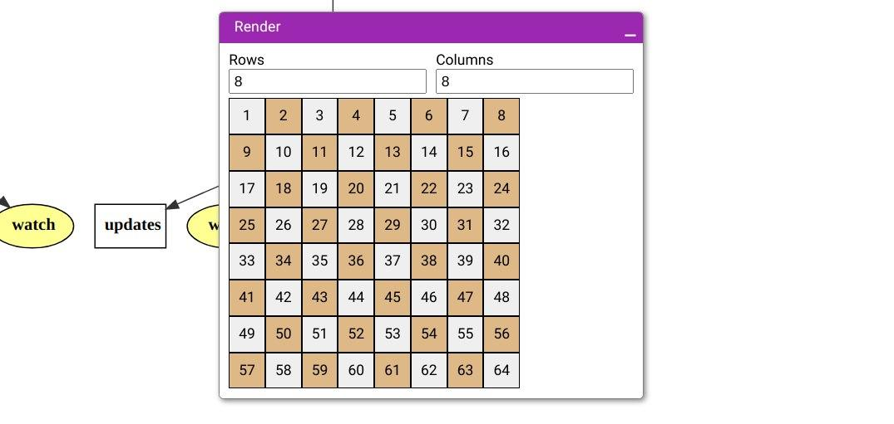

# playground

### Example with margin/padding





```javascript
const pText = div().bg('white');
const pCell = div().style('white-space: nowrap;').border(1, 'red').bg('lightgray').m(0).p(0);
const cell = div().style('white-space: nowrap;').border(1, 'red').bg('white').m(0).p(0);
const pWrapper = div().size(250, 50);
const mWrapper = div().size(250, 50).bg('lightgray').h('100%');
const styledRow = row().top().gap(10);
const styledCol = col().gap(2);

render(
  styledCol(
    styledRow(
      pWrapper('Paddings').center(), pWrapper('Margins').center(),
    ).h(24).fontSize(18),
    styledRow(
      pWrapper(pCell(pText('padding')).p(12, 20)),
      mWrapper(cell('margin').m(12, 20)),
    ),
    styledRow(
      pWrapper(pCell(pText('padding-left')).pl(20)),
      mWrapper(cell('margin-left').ml(20)),
    ),
    styledRow(
      pWrapper(pCell(pText('padding-right')).pr(20)),
      mWrapper(cell('margin-right').mr(20)),
    ),
    styledRow(
      pWrapper(pCell(pText('padding-left + padding-rigth')).px(20)),
      mWrapper(cell('margin-left + margin-rigth').mx(20)),
    ),

    styledRow(
      pWrapper(pCell(pText('padding-top')).pt(12)),
      mWrapper(cell('margin-top').mt(12)),
    ),
    styledRow(
      pWrapper(pCell(pText('padding-bottom')).pb(12)),
      mWrapper(cell('margin-bottom').mb(12)),
    ),
    styledRow(
      pWrapper(pCell(pText('padding-top + padding-bottom')).py(12)),
      mWrapper(cell('margin-top + margin-bottom').my(12)),
    ),
  )
)
```

### Chessboard example



```javascript
const black = div().size(40).border(1).center().bg('burlywood');
const white = div().size(40).border(1).center().bg('#efefef');

const setRows = createEvent();
const $rows = restore(setRows, 3);

const setCols = createEvent();
const $cols = restore(setCols, 8);


render(
  row(
    input('Rows', $rows, setRows),
    input('Columns', $cols, setCols),
  ).gap(10),

  col($rows, line => 
    row($cols, (column, total) => (column + line) % 2 
      ? black(line * total + column + 1) 
      : white(line * total + column + 1)
    ),
  )
);

```
